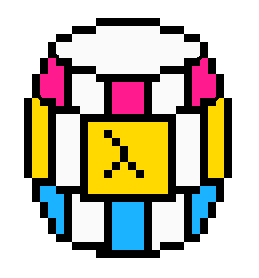

# barrel

an esoteric golfing stack language heavily inspired by Joy, K and CJam.

# examples

hello world:
```racket
"hello world"
```

quine:
```
1
```

# install

install racket, and then the barrel packgae. If the racket 8.4 folder is in your path, then you have the barrel executables `barrel` and `brl`.
